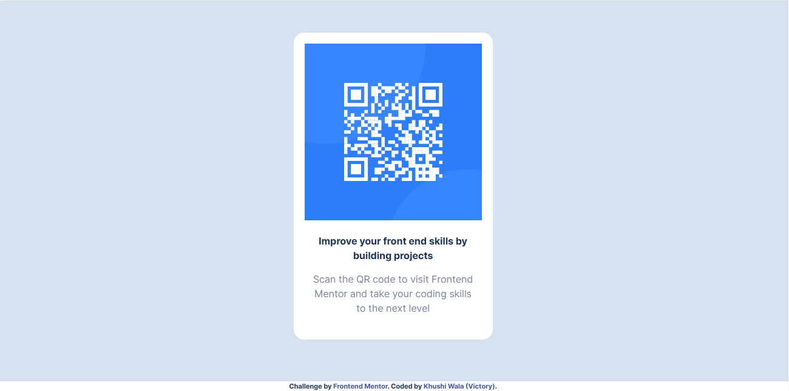
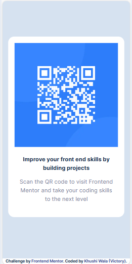

<!DOCTYPE html>
<html lang="en">

<body>
  <h1>QR Code Component Challenge</h1>
  
This project builds a responsive QR code component based on the design specifications provided by Frontend Mentor.

  
  <h2>Website Link</h2>
  
<a href="https://qr-code-component-khushiwala.vercel.app/">qr-code-component-khushiwala.vercel.app</a>

 

 
  <h2>Language and Tools</h2>
  
Basic HTML and CSS with Next.js framework. 

 

  <h2>Preview Images</h2>

  
Here are previews of the component on various screen sizes:

  <figure>
    <figcaption><b>Desktop Preview</b></figcaption>
    
  </figure>

  <figure>
      <figcaption><b>Mobile Preview</b></figcaption>
    
  </figure>

  <h2>Design Specifications</h2>

  
Refer to the Frontend Mentor challenge page for detailed design specifications, including colors, fonts, and layout. <a href="https://www.frontendmentor.io?ref=challenge">Frontend Mentor</a>

  

  <i><b>
Happy coding!
</b></i>
</body>
</html>
